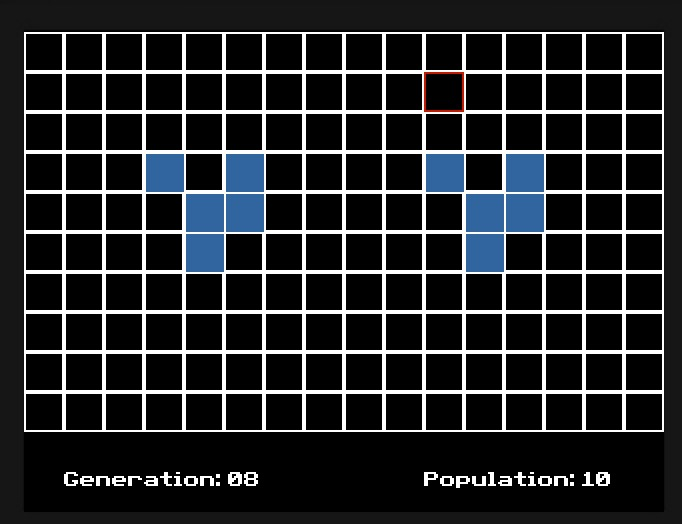

# Conway-CE

This is a port of Conway's Game Of Life to the TI 84-Plus CE. The rules of the game are as follows:  

- A live cell with fewer than 2 neighbors dies (underpopulation)
- A live cell with 2 or 3 neighbors survives
- A live cell with more than 3 neighbors dies (overpopulation)
- A dead cell with exactly 3 neighbors becomes alive (reproduction)

I hope you enjoy!  

## Controls  

Arrow Keys: Move the cursor to select a cell.  
Enter: Toggle a cell between alive and dead.  
Alpha: Start or pause the simulation.  
2nd: Exit the Program.  
Clear: Reset Entire Board.

## Installation  

To build from source, ensure you have the CEdev toolchain installed. Then once you clone the respository, run:

```sh
make clean && make
```

This will generate the `.8xp` file for use on the calculator.  
Transfer the file to your TI-84 Plus CE calculator using [TI-Connect CE](https://education.ti.com/en/products/computer-software/ti-connect-ce-software).  
Run the program using a shell like Cesium or AsmPgrm().

## Credits

John Conway (Original Creator)  
CE-Toolchain Developers

## Screenshots  


